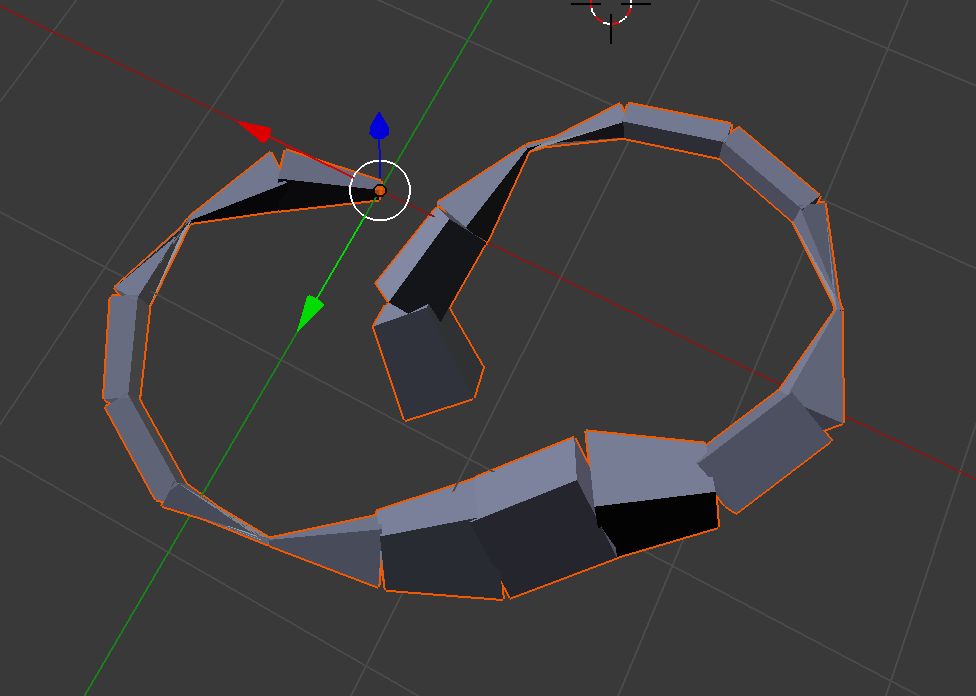
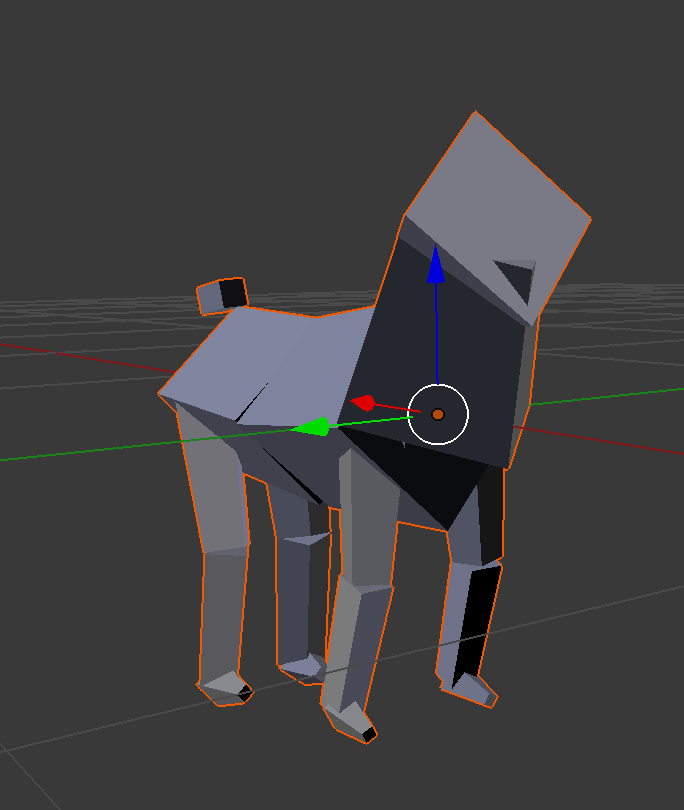

# animalclub (WIP)

_Animal Club_ (AC) is still in development. Each "animal" is made of `DNA` and several `Genotype`s written in a special purpose monad. Using the `Skellygen` and `Animal` module, the animal's `Genome` can be mapped onto a parameterized mesh generator to create unique 3D meshes for each genetic expression of the animal.

# genetics
`Genetics` is a general purpose genetic expression module. `DNA` is a bit array. When breeding two `DNA`s, 1 bit out of every 2 from each parent is randomly chosen and put together to be the the 2 new bits of child's `DNA`.

`Gene` is a computation on an indexed subset of `DNA`. The `Genotype` monad is a Writer / State monad for creating computations on `Genes`. AC includes several basic computations for either strategically or randomly creating these computations. The State portion contains hierarchical info about what part of the `DNA` (Genes) to operate on. The writer portion is where the user writes out computed values with string labels to be read by another program. A typical usage might look something like this:

```haskell
import           AnimalClub.Genetics

-- AnimalClub provides support methods for the writer Monoid [(Text,[Float])]
-- such as tellGene and tellGenes. You are free to use whatever Monoid you want.
example = do
	gbNormalizedSum >>= tellGene "Some Label 1"
    gbNormalizedThresh 0.5 >>= tellGene "Some Label 2" . (\x -> if x then 1 else 0)
    a1 <- gbTypical (0,100)
    a2 <- gbTypical (0,100)
    tellGenes "third" [a1,a2]
    gbRandomRanges [(0,1) | _ <-[(0::Int)..9]] >>= tellGenes "Some Label 3"
```

This is a worm that was bred to curl into a circle with sinusoidal growth:



# skellygen

The `Skellygen` module contains a special parametrizable mesh generating data structure. It's rather esoteric but totally works.

Here is a goat generated using `Skellygen`



# animals
The `Animals` module bridges `Genetics` and `Skellygen`.

It has two components.

`Animal` contains methods for creating a base skeleton upon which phenotypes from `Genetics` are then applied.

`Builders` contains methods for automatically generating `Genotype`s based on a high level specification.

# foreign bindings
The `ForeignBindings` module creates a dynamically linked C library that exposes some methods in `Genetics` and `Skellygen`.

# roadmap
Next step is to finish [goatbreeder](https://github.com/pdlla/goatbreeder) which is is the example use case and testing environment for `AnimalClub`. It lets you click to choose which goats you want to breed.
